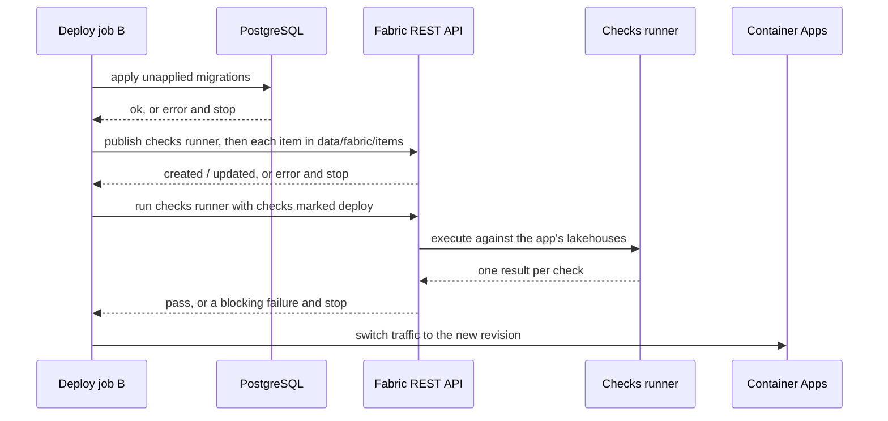

# 09 — Fabric

An app that needs analytics storage, ML model construction, or deterministic data checks
declares a **Microsoft Fabric workspace** in its `data/` folder, alongside or instead of
its PostgreSQL database ([08-data.md](08-data.md)). The platform provisions the
workspace, publishes the app's Fabric items to it at deploy, runs the app's data checks,
and keeps every credential on the platform side. Decided 2026-09-08 (D26, D27);
workspace topology and publisher implementation are recommended defaults (D28, D29).

**Status 2026-09-16: not built.** No workspace, no publisher, no checks runner. This page
is the specification.

## Why a second target and not a request

D4 says anything non-relational is a request with a reason, revisited once three apps
ask. Fabric is different from a queue or a blob container in two ways that make it a
declared target instead:

- **It is a place data lives, not a new kind of store.** An app that trains a model or
  checks data quality is reaching for tables in OneLake. *Assumption to confirm:* whether
  the organization already keeps analytical data in Fabric is unknown at the time of
  writing. Either way, refusing Fabric pushes people to copy data into Postgres, which
  is worse.
- **Notebooks and pipelines are code, and code needs the gates.** A Fabric workspace
  edited by hand in the portal has no history, no review, and no check that its
  dependencies are safe. Treating it as a deploy target puts it under the same rules as
  everything else in the repo.

The `data/` folder is still the one place an app declares what it persists to. Fabric is
a second `data/` target; it is not a third top-level concern.

## What the platform provides

| Concern | Platform behaviour |
|---------|--------------------|
| Workspace | One Fabric workspace per app that declares `fabric:`, on the shared platform capacity, named after the app. Created at admission by Terraform (D28). |
| Publish | Every deploy publishes the item definitions in `data/fabric/items/` to the workspace, creating or updating each item. Items in the workspace that are not in the repo are left alone but flagged on the dashboard. |
| Checks | Every deploy runs the app's checks marked `deploy`; a failing `block` check stops the deploy before the revision switch. Checks marked `scheduled` run daily. Results go to the dashboard. |
| Identity to Fabric | Owner and maintainers are workspace Admins. The app's deploy identity is a Contributor on this workspace only. The app's runtime identity has nothing in Fabric unless declared, and never more than the owner holds. |
| Data reached from the app | In `user` mode, the app queries the workspace's SQL analytics endpoint on behalf of the signed-in user. In `app` mode, its managed identity gets Viewer on its own workspace, and only if the owner is at least Viewer. |
| Storage | Lakehouses declared in the repo; OneLake storage billed to the platform capacity. |
| Retirement | Deleting the app's infrastructure definition deletes the workspace and everything in it. |

## The `data/` folder with Fabric

```
data/
  config.yaml            # store: postgres | postgres-dedicated | none
                         # fabric: { workspace: per-app, checks: { schedule: daily } }
  schema.ts              # Postgres, as in 08-data.md; absent when store is none
  migrations/            # Postgres, as in 08-data.md
  fabric/
    items/               # Fabric's native item-folder format; one folder per item
      Bronze.Lakehouse/
        .platform
      Default.Environment/
        .platform
        Setting/Sparkcompute.yml
        Libraries/PublicLibraries/environment.yml
      Ingest.Notebook/
        .platform
        notebook-content.py
      Train.Notebook/
        .platform
        notebook-content.py
      Score.DataPipeline/
        .platform
        pipeline-content.json
    checks/              # deterministic data checks, one file each
      orders-have-customer.check.yaml
    README.md            # template-provided: how to work in the workspace and pull changes back
```

**Why Fabric's own item format.** Each item is a folder whose name carries the type, with a
`.platform` metadata file and the definition files that Fabric's REST API and Git
integration both read and write. The repo holds exactly what the API accepts, and what a
workspace exports. There is no format of ours to maintain, and a developer who has
worked with Fabric's Git integration elsewhere sees the same layout.

`data/config.yaml`:

```yaml
store: postgres            # unchanged; none if the app has no relational data
fabric:
  workspace: per-app       # the only value in v1 (D28); presence declares the workspace
  capacity: shared         # shared platform capacity; dedicated is a request per D4
  checks:
    schedule: daily        # when checks marked `scheduled` run: daily | none
```

## Allowed item types

The allow-list is short on purpose. Each type is a deploy surface the gate must lint and
the publisher must know how to create.

| Item type | For | Why allowed |
|-----------|-----|-------------|
| `Lakehouse` | Tables and files the app's notebooks read and write | The storage unit; nothing works without it |
| `Environment` | Spark settings and the Python libraries notebooks may use | Where dependencies are declared, so where the dependency rules apply |
| `Notebook` | Ingest, transform, feature engineering, training | The unit of code |
| `DataPipeline` | Scheduling and ordering notebooks | Orchestration without a second scheduler |
| `SparkJobDefinition` | A notebook that has grown into a script | Same rules as a notebook |
| `MLExperiment`, `MLModel` | Tracking runs and registering models | The point of ML construction. **Verify** definition-API and service-principal support before the first ML app (see "Not proven") |

Not allowed in v1, each for a reason: `Warehouse` (a second SQL dialect, and DDL the
gate would have to lint), `Dataflow` (connections that carry credentials), `Eventstream`
and `KQL*` (a third engine), `Report` and `SemanticModel` (business intelligence has its
own path in the organization; a citizen app is not it). Anything not listed is rejected
at Gate 2 with the reason.

## Deterministic data checks

A check is a read-only query with an exact expected result. It is deterministic because
the query is a single `SELECT` over lakehouse tables, returns one row, and the row is
compared exactly. The same data always gives the same verdict.

```yaml
# data/fabric/checks/orders-have-customer.check.yaml
name: orders-have-customer
description: Every order references a known customer.
target: Bronze                 # the Lakehouse item the query runs against
query: |
  SELECT COUNT(*) AS orphaned
  FROM orders o
  LEFT JOIN customers c ON o.customer_id = c.id
  WHERE c.id IS NULL
expect:
  orphaned: 0                  # exact match on every named column of the single row
severity: block                # block: a failure stops the deploy. warn: reported only.
when: [deploy, scheduled]      # deploy: runs in Gate 3. scheduled: runs on the schedule.
```

**Who runs it.** Not the app, and not a notebook the developer wrote. The platform
publishes one **checks runner** notebook into every Fabric workspace, overwritten on
every deploy so an edited copy changes nothing. The deploy job starts it with the
app's check files as parameters, waits for it, and reads back one result per check. The
developer owns the queries and the expectations; the platform owns the thing that
executes them. That is the "one rule implementation, two owners" principle from
[05-platform-gates.md](05-platform-gates.md) applied to data.

**What the gate lints, without executing.** One statement, `SELECT` only. No
non-deterministic functions (`NOW()`, `CURRENT_TIMESTAMP`, `RAND()`, `UUID()`), which
warn, because a check that depends on the clock is not a check. `target` must name a
`Lakehouse` in `items/`. Every key under `expect` must be a column the query names.

**What a failure looks like.** A blocking check that fails at deploy stops the deploy
exactly as a failed migration does: the previous revision keeps serving, the developer
sees the check name, the expected value, and the actual value in plain terms. A
scheduled check that fails marks the app *degraded* on the dashboard and tells the
owner; it does not deactivate anything, because bad data is not the same as a broken
app.

## ML model construction

The developer writes notebooks that read from a lakehouse, engineer features, train, and
log runs to an `MLExperiment`; a chosen run is registered as an `MLModel`. All of that is
Fabric's standard MLflow flow and none of it is platform code. The platform's job is to
get the notebooks, environment, and pipeline into the workspace under the gates, and to
run the checks that say the training data is fit to train on.

**How a model reaches the app.** Batch scoring. A scheduled pipeline runs a scoring
notebook that writes predictions to a lakehouse table; the app reads that table through
the workspace's SQL analytics endpoint as the signed-in user. The app never loads a
model, never runs Python, and never holds a Fabric credential. Real-time inference from
the app is not offered in v1 (see "Not proven").

**Python, inside Fabric only (D27).** Notebooks are Python. This does not change D2: the
app is still TypeScript and React, and Python never runs in the container or on the
platform. It runs inside Fabric's Spark runtime, and its dependencies are declared in the
`Environment` item, where the same rules as `package.json` apply: exact versions, an
allow-list, a budget, and a minimum release age.

## How changes reach the workspace

1. Developer edits or adds items under `data/fabric/items/`, or pulls them from the
   workspace with the deploy skill (below). Edits a check. Runs `npm run check`, which
   lints the item definitions, the environment's libraries, and the check files.
2. Push. Gate 2 runs the authoritative copy of the same lint.
3. Gate 3, in the deploy job that holds credentials and never runs app code
   ([07-deploy-credential-flow.md](07-deploy-credential-flow.md)):



4. Order matters. Migrations first because the app's own schema is the cheapest thing to
   fail on. Items before checks because a check may target a lakehouse the same deploy
   creates. Checks before the revision switch because that is the whole point.
5. A failure at any step stops the deploy. Items already published in that deploy stay
   published; publishing is idempotent, so the next deploy converges. The revision does
   not switch.

## Identity

Everything follows the rule in [02-hosting-contract.md](02-hosting-contract.md): the app
cannot outrank its owner, and no long-lived credential exists anywhere.

| Who | Fabric access | How |
|-----|---------------|-----|
| Owner, maintainers | Admin on the app's workspace | Terraform role assignment at admission; removed with the owner's retirement clock |
| App's deploy identity | Contributor on the app's workspace, nothing else in Fabric | Terraform at admission. The OIDC token from the reusable workflow is exchanged for a Fabric API token, minutes long |
| Checks runner | Runs as the deploy identity, in the workspace | Started by the deploy job; reads only the app's lakehouses |
| App runtime, `user` mode | None standing. Queries the SQL analytics endpoint on behalf of the signed-in user | On-behalf-of exchange, the same as any downstream API |
| App runtime, `app` mode | Viewer on its own workspace, only if the owner is at least Viewer there | Declared in `app.yaml` `identity.roles`; verified at admission and monthly |
| Platform monitoring identity | Viewer on every workspace | For the dashboard's item inventory and capacity usage |

**Shortcuts and outside data.** A lakehouse may hold a OneLake shortcut to a table in
another workspace. That is the one way an app reaches data it did not create, and the
subset rule applies: the shortcut target must be readable by the owner. Admission checks
every shortcut in `items/`; the monthly re-check does it again. A shortcut the owner can
no longer read is removed from the app's lakehouse the same day.

**Tenant prerequisite.** Fabric's tenant settings must allow service principals to use
Fabric APIs and to be assigned workspace roles. This is a one-time identity-team request
in the corporate tenant and is on the D6 list.

## Gate rules for Fabric

| Rule | Gate | Severity | Rationale |
|------|------|----------|-----------|
| Item type is on the allow-list | 2 | block | Each type is a publish and lint surface we chose to support |
| Every item folder has a valid `.platform` file and the definition files its type requires | 2 | block | The publisher would fail later with a worse message |
| `Environment` libraries: exact versions, allow-listed, under budget, past minimum release age | 2 | block | The dependency rules do not stop at `package.json` |
| Notebook outputs stripped; no cell output in the committed definition | 2 | block | Outputs leak data into history and make diffs unreadable |
| No connection, key, token, or password in any definition file | 2 | block | The secret scan, extended to Fabric definitions |
| Check files: single `SELECT`, `target` exists, `expect` keys match columns | 2 | block | A check that cannot run is a check that lies |
| Check query uses a non-deterministic function | 2 | warn | A clock-dependent check is not deterministic |
| Shortcut target readable by the owner | 1, 4 | block | The subset rule applied to data |
| `fabric:` declared without any item in `items/` | 2 | block | A workspace with nothing in it is a mistake |
| Publish fails for any item | 3 | block | The deploy stops; the previous revision serves |
| A `block` check marked `deploy` fails | 3 | block | Data the app is about to depend on is wrong |
| A `block` check marked `scheduled` fails | 4 | degraded | Owner told; nothing deactivated |
| Item in the workspace with no counterpart in the repo | 4 | flag | Portal edits are allowed for experimenting; the dashboard says what is unmanaged |

## The developer loop

There is no local Fabric. PGlite gives Postgres a local story; nothing gives Fabric one,
and pretending otherwise would be a lie in the template. Instead:

1. The developer opens the app's workspace in the Fabric portal, where they are Admin,
   and experiments: writes a notebook, tries a query, trains a model.
2. When something is worth keeping, `deploy-citizen-app` offers **pull from workspace**:
   it exports the chosen items' definitions into `data/fabric/items/` using the
   developer's own delegated Fabric token, obtained with a device-code sign-in as the
   developer. No Azure CLI, no subscription, nothing installed. The export is a plain
   file change; the developer reviews it and the skill commits and pushes as usual.
3. The next deploy publishes it back. Anything the developer changed in the portal after
   pulling is overwritten by the repo's version, which is the point.

**Direction is fixed.** Repo to workspace is always the platform, in the deploy job.
Workspace to repo is always the developer, on their laptop, as themselves. No bot
commits to the repo on the developer's behalf (D24).

## Rejected approaches

**Fabric's built-in Git integration, pointed at the app repo.** It needs a GitHub
personal access token stored in Fabric, which is a long-lived credential the design
forbids. It is bidirectional, so a portal edit reaches the repo without passing Gate 2.
It commits as a connection, not as the developer, which D24 rules out. Developers may
still use it against a personal sandbox workspace that the platform does not know about;
that is their business.

**Microsoft's `fabric-cicd` Python library in the deploy job.** It knows the item types,
their publish order, and parameter substitution, and it would save work. It also puts a
Python dependency tree in the platform repo, which is the one repo whose supply chain
matters most ([07-deploy-credential-flow.md](07-deploy-credential-flow.md), point 4).
With six allowed item types, a publisher in Node built-ins calling the Items REST API
directly is a bounded job and matches the gate engine's own rule. The library is the
fallback if the publisher proves harder than expected (D29).

**One shared Fabric workspace for the fleet.** Fabric permissions are workspace-scoped;
there is no per-item role that survives contact with a lakehouse's SQL endpoint. A shared
workspace would make every app's data readable by every other app's owner. Per-app
workspaces match the database-per-app isolation already chosen (D28).

## What the platform records for the dashboard

- Per deploy: items published, each with created or updated, and the checks run with
  pass or fail, expected, actual, and duration. Same Log Analytics table as gate results.
- Per scheduled run: the same, per check.
- Per workspace, daily: item inventory, items unmanaged by the repo, capacity units
  consumed. Capacity units are the only per-app cost signal Fabric offers; see below.

## Not proven, and open

- **ML item support.** Whether `MLExperiment` and `MLModel` items can be created and
  updated through the definition API by a service principal has lagged other item types.
  Until verified against the current API, the first ML app may need to create those two
  items in the portal once, with the notebooks and pipeline still managed from the repo.
  The doc says which items are managed; it must stay honest about which are not.
- **Cost attribution.** Fabric bills by capacity, not by tagged resources, so the
  `app=` tag that makes every other cost exact does not exist here. The dashboard's
  Fabric column is capacity units per workspace from the Capacity Metrics data, which is
  a usage share, not a dollar figure. Until the platform decides how to convert it, the
  Fabric cost appears on the shared "platform" row.
- **Real-time inference.** Not offered. If an app needs a prediction per request rather
  than a scored table, that is a new decision, not a quiet addition.
- **Dedicated capacity.** Any app whose workloads need their own capacity is a request
  per D4.
- **Item drift the other way.** The publisher does not delete workspace items missing
  from the repo. Whether it should, after a grace period, is open.
